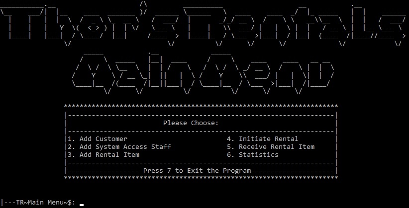

 

 <h3> Arctic Equipment Rental Management System 
 
 

 
 

 
 &nbsp;&nbsp;&nbsp;&nbsp;  &nbsp;&nbsp;&nbsp;&nbsp;  &nbsp;&nbsp;&nbsp;&nbsp;  &nbsp;&nbsp;&nbsp;&nbsp;      &nbsp;&nbsp;&nbsp;&nbsp;    

## Background
(** fictional backstory start ** - For entertainment ONLY - please DO NOT read if you just want info about the repo**) 
 
Thor held a high-flying job at a Magic Circle law firm in London for the best part of the past two decades. It made him incredibly wealthy on the outside, however, somewhat hollow on the inside due to the job-related pressure he experienced daily. Hence, he decided to quit his job, liquidate all his stock market positions and sell his home to move to somewhere where air is fresh and life-induced stress is minimal. After a brief search, Thor settled in Zermatt, Switzerland. 
Having enjoyed for a while everything that beautiful Switzerland has to offer, Thor decided once again to enter the working world by the virtue of opening a business. Naturally, the nature of Thor's business should have something to do with the quirks of his new-found surroundings. Thus, he decided to open an arctic equipment rental business and name it imaginatively "Thor's Arctic Equipment Rentals". After purchasing a plethora of new equipment, he thought to himself: "How on Earth am I going to keep track of all this gear with customers renting and returning things all the time?"  
After a period of deep frustration, Thor had an astonishing idea! "Ha!", said Thor to himself and continued: "A software system to keep track of customers, staff, rental income, outgoing and incoming equipment and such must be the way forward!" 
Luckily for Thor, he had just the right person in mind to help him. Thor could not contain his enthusiasm when he picked up his shiny new iPhone and dialled a number recovered from the confines of his impossibly enormous contact list. 
"Hel-lo?", said the slightly weary voice on the other end of the line clearly wondering who on Earth would call from Switzerland at this hour.  "@tenngs? Drop whatever nonsense you are doing right now! I have an urgent mission for you..."   
(**fictional backstory end **)

## What does it do?
Thor's Rentals provides an arctic rental equipment management system which is aimed to be utilised by a rental shop staff member. Currently, Thor's stocks skis, snowboards and ATVs. It allows for adding customers, granting system access for existing staff members, adding rental items, managing outgoing and incoming rental equipment and providing inventory and business-related statistics. The system further provides moderate to high user input validation and a login facility.  
TL;DR add customers, system access staff, equipment, provide statisctics, calculate when equipment is due back and update inventory.

## How does it do it?
Thor's Rentals' 90s-inspired and ASCII Art-rich user interface interacts with thors_rentals sqlite3 database containing various tables where information can be added to and retrieved from. For example, adding a customer involves gathering customer details and saving them into a table in the database and logging in involves querying a database to validate login credentials. 
Furthermore, the system keeps track about when rental items are due to be returned and the state of current inventory by retrieving information from a database and computing the result when requested.  
TL;DR "old-school" UI interacts with sqlite3 database to write, retrieve and compute rental-related stuff.

## OK, but why?
I have a passion for C++ language. Whilst contemplating a project idea, I came across a myriad of car rental, hospital and student management systems made by others. I also wanted to make a management system of some sort, but simultaneously one that is not so common and fits my preferences.

## Let's have a look-see, shall we?

### Main Menu    

### Statistics Menu    

### Initiating ATV rental - error checking for invalid user input 

### Receiving an item back from loan - again, error checking for invalid user input 
  

## Dependencies
Apart from the provided C++ and ASCII Art files, this project requires the following:
1) MinGW
2) gcc compiler (built with MinGW)
3) MinGW threads
4) Sqlite3

## How to install dependencies for Windows 
### MinGW & gcc compiler
1) As it is a slightly lengthy process, please check out this video: https://www.youtube.com/watch?v=Zcy981HhGw0&t=80s 
### MinGW threads
1) I have included the required mingw.thread.h file in the repo. However, if you would like to get it yourself, please clone this repo: https://github.com/meganz/mingw-std-threads.git
### Sqlite3 
1) Download precompiled binaries for Windows (32 or 64 bit) from https://www.sqlite.org/download.html
2) Place binaries into a directory. For example: C:\sqlite3
3) Add the directory where binaries were placed in step 2) to PATH (please check out https://www.youtube.com/watch?v=gb9e3m98avk if not familiar)
4) Download "sqlite amalgation" C source code from  https://www.sqlite.org/download.html (at the time of writing, first link from top to bottom)
5) Place sqlite3.c and sqlite3.h from "sqlite amalgation" download into a C++ project directory
6) Compile using: gcc sqlite3.c -c to produce sqlite3.o file
### Notes
1) I have provided the required sqlite3.o and sqlite3.h files in the repo. However, it is not guaranteed that they will work on your computer just because they work on mine. If in doubt, please follow the installation steps above to create your own.
## Compiling
Please compile the project using g++ *.cpp sqlite3.o -LC:\sqlite3 
(where: C:\sqlite3 is the directory for sqlite that
was added to PATH)

 

